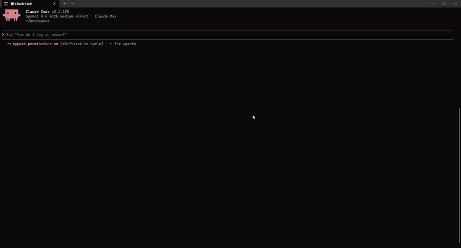

# BeauticsLab MCP

**"내 루틴에 자극 성분 있어?" Claude한테 물어보세요.**

올리브영·다이소·이커머스(네이버, 쿠팡, 11번가 등) 카탈로그와 BeauticsLab에 등록한 내 루틴을, 내가 쓰는 AI 안에서 그대로 분석합니다. 제품 검색, 루틴 조회, 전성분 분석까지.

서비스: [beauticslab.com](https://beauticslab.com) · [English](./README_en.md)



> Claude Desktop에서 BeauticsLab MCP 호출: 비타민C 세럼 추천부터 내 루틴과 겹치는지 확인까지 40초. ([고화질 영상](https://github.com/user-attachments/assets/70f9f9ac-2a72-466c-9c19-9f5e7a3576a1))

---

## 한눈에

- **서버 주소**: `https://mcp.beauticslab.com/mcp`
- **연결**: AI 도구의 "Custom Connector / MCP Server 추가"에 위 주소 입력 → BeauticsLab 계정 로그인 → 권한 허용
- **계정**: beauticslab.com Google / Kakao 로그인 계정 그대로
- **상태**: 베타 (무료)

---

## 무엇을 할 수 있나

내가 쓰는 AI한테 그냥 말 걸면 됩니다.

- 🔍 **"건성인데 알코올 없는 토너 추천해줘"** → 올리브영·다이소·이커머스(네이버, 쿠팡, 11번가 등) + BeauticsLab 검증 카탈로그에서 검색
- 📋 **"내 저녁 루틴 보여줘"** → BeauticsLab에 저장한 내 스킨케어 루틴 조회
- 🧪 **"닥터디퍼런트 비타리프트 전성분에 자극 성분 있어?"** → 전성분(국문/영문) + EWG 등급 조회

AI가 위 결과를 받아서 비교·추천·답변까지 한 번에 만들어 줍니다.

> 읽기만 합니다. 데이터를 바꾸거나 새로 만들지 않습니다.

---

## 쓸 수 있는 도구

| 도구 | 설명 |
|---|---|
| `search_product` | 키워드로 제품 검색 (한국어 권장). 올리브영, 다이소, 이커머스(네이버·쿠팡·11번가 등), 검증 커스텀 4개 소스 |
| `get_my_routine` | 내 BeauticsLab 계정의 루틴 + 들어있는 제품 + (선택) 핵심 성분 요약 |
| `get_product_ingredients` | 한 제품의 전성분 + EWG 등급. 앞 두 도구가 돌려준 `goodsNo`를 그대로 넘기면 됩니다 |

검색이나 루틴 조회로 제품을 찾고, 그 중 궁금한 제품의 전성분을 `get_product_ingredients`로 파고드는 흐름입니다.

남의 데이터는 못 봅니다. 내 계정 안에서만 동작합니다.

---

## 연결하기

AI 도구마다 연결 방법이 다릅니다. 본인이 쓰는 도구 섹션만 읽으면 됩니다.

> 아래 가이드는 2026-05-13 기준. 각 AI 도구의 UI 위치나 메뉴명은 바뀔 수 있습니다.

### Claude Desktop · claude.ai

**Claude Desktop**
1. `Settings → Connectors` 진입
2. 화면 하단 **"Add custom connector"** 클릭
3. URL에 `https://mcp.beauticslab.com/mcp` 입력 후 Add
4. 새 브라우저 창에서 BeauticsLab 로그인 → "허용" → Claude로 돌아옴
5. 새 채팅에서 "내 BeauticsLab 루틴 보여줘" 시도

**claude.ai 웹 (Pro/Max)**
1. `Customize → Connectors → +` (Add custom connector)
2. URL 입력 → 이하 동일

**claude.ai Team / Enterprise**
- 조직 오너가 `Organization settings → Connectors → Add → Custom → Web`에서 등록
- 멤버는 `Customize → Connectors`에서 활성화

> Advanced settings의 Client ID/Secret 필드는 **비워 두세요**. 서버가 동적 클라이언트 등록(DCR)을 처리합니다.

출처: [Anthropic: Custom connectors with remote MCP](https://support.claude.com/en/articles/11175166-get-started-with-custom-connectors-using-remote-mcp)

---

### ChatGPT

> ChatGPT는 2025-12-17부터 "Connectors"를 공식적으로 **"Apps"**로 표기합니다.

1. `Settings → Apps & Connectors → Advanced settings → Developer Mode` 토글 ON
2. `Settings → Apps & Connectors → Create`
3. 입력값
   - Name: `BeauticsLab`
   - Connector URL: `https://mcp.beauticslab.com/mcp`
4. 저장하면 OAuth 인증 페이지로 이동 → BeauticsLab 로그인 → 허용
5. 새 대화에서 BeauticsLab 도구 호출

> ChatGPT는 등록 시 "OpenAI가 검증하지 않은 커스텀 MCP 서버" 경고 배너를 표시합니다. 정상입니다.

출처: [OpenAI: Connect from ChatGPT (Apps SDK)](https://developers.openai.com/apps-sdk/deploy/connect-chatgpt)

---

### Cursor

설정 파일 위치 (둘 중 하나):
- 전체 적용: `~/.cursor/mcp.json`
- 프로젝트 한정: `<프로젝트>/.cursor/mcp.json`

내용:

```json
{
  "mcpServers": {
    "beauticslab": {
      "url": "https://mcp.beauticslab.com/mcp"
    }
  }
}
```

UI에서 추가하려면 `Cursor Settings → Tools & MCP → New MCP Server`.

저장 후 Cursor가 자동으로 브라우저 OAuth 팝업을 띄웁니다. BeauticsLab 로그인 → 허용 → 자격증명은 Cursor가 보관합니다 (JSON에 노출되지 않습니다).

출처: [Cursor: Model Context Protocol](https://cursor.com/docs/mcp)

---

### VS Code (GitHub Copilot Chat)

설정 파일 위치:
- 워크스페이스: `.vscode/mcp.json`
- 사용자 전역: 커맨드 팔레트 → `MCP: Open User Configuration`

내용:

```json
{
  "servers": {
    "beauticslab": {
      "type": "http",
      "url": "https://mcp.beauticslab.com/mcp"
    }
  }
}
```

출처: [VS Code: MCP configuration reference](https://code.visualstudio.com/docs/copilot/reference/mcp-configuration)

---

### Cline (VS Code 확장)

OAuth + DCR 흐름이 가장 매끄럽게 검증됨.

1. Cline 사이드바 → **Remote Servers** 탭
2. URL 입력: `https://mcp.beauticslab.com/mcp`
3. **Authenticate** 버튼 → 브라우저 OAuth → 자격증명 영구 저장

또는 config 직접 편집:

```json
{
  "mcpServers": {
    "beauticslab": {
      "url": "https://mcp.beauticslab.com/mcp",
      "type": "streamableHttp",
      "disabled": false,
      "autoApprove": [],
      "timeout": 60
    }
  }
}
```

출처: [Cline: Connecting to a Remote Server](https://docs.cline.bot/mcp/connecting-to-a-remote-server)

---

### Zed

`settings.json`의 `context_servers` 항목에 추가:

```json
{
  "context_servers": {
    "beauticslab": {
      "url": "https://mcp.beauticslab.com/mcp"
    }
  }
}
```

Authorization 헤더 없이 저장하면 Zed가 표준 MCP OAuth 흐름으로 자동 안내합니다.

출처: [Zed: Model Context Protocol](https://zed.dev/docs/ai/mcp)

---

### 기타 MCP 호환 클라이언트

위에 없는 클라이언트라도 다음 조건을 만족하면 동작합니다.

- MCP **Streamable HTTP** transport 지원
- **OAuth 2.1 + PKCE(S256)** 지원
- 가급적 **Dynamic Client Registration(DCR)** 지원 (없으면 사전 등록 client 필요)

Endpoint만 알면 됩니다: `https://mcp.beauticslab.com/mcp`

클라이언트별 호환성은 [modelcontextprotocol.io/clients](https://modelcontextprotocol.io/clients) 참고.

---

## 인증 / 권한

- 프로토콜: OAuth 2.1 + PKCE(S256) + Dynamic Client Registration
- 스코프: `mcp:read` (읽기 전용)
- 로그인 주체: BeauticsLab 계정 (Google / Kakao 소셜 로그인)
- 익명 모드 없음: 모든 호출은 사용자 컨텍스트가 필요합니다

서버 메타데이터 (확인용):
- `https://mcp.beauticslab.com/.well-known/oauth-protected-resource`
- `https://mcp.beauticslab.com/.well-known/oauth-authorization-server`

---

## FAQ

**Q. 내 루틴이 외부로 유출되나요?**
아니오. 내가 로그인한 AI 세션에서만 내 데이터에 접근합니다. 응답은 그 AI 클라이언트로만 갑니다. 남의 데이터는 못 봅니다.

**Q. 어떤 AI 도구가 지원되나요?**
검증된 도구는 Claude Desktop, claude.ai, ChatGPT, Cursor, Cline, Zed, VS Code(Copilot Chat). 그 외에도 MCP 표준(Streamable HTTP + OAuth 2.1, 2025-11-25)을 지원하는 클라이언트면 다 됩니다.

**Q. 데이터 출처는 어디인가요?**
올리브영, 다이소, 이커머스(네이버·쿠팡·11번가 등) 공개 카탈로그와 BeauticsLab에서 검증한 커스텀 제품입니다.

**Q. 한국어/영어 어느 쪽이 잘 검색되나요?**
한국어가 잘 잡힙니다. 영어도 되긴 하는데 정확도가 떨어집니다.

**Q. 연결 끊거나 권한 회수하려면?**
쓰던 AI 도구의 Connectors / MCP 설정에서 BeauticsLab 항목을 지우면 됩니다. 토큰은 클라이언트에 보관되고 만료되면 자동 폐기됩니다.

**Q. 사용량 제한이 있나요?**
베타라 SLA는 없습니다. 비정상 트래픽 패턴은 차단될 수 있습니다.

---

## 지원

- 문의 / 이슈 신고: [BeauticsLab 사이트의 카카오톡 문의하기](https://beauticslab.com)

---

## 라이선스

Proprietary. All rights reserved. © BeauticsLab.
